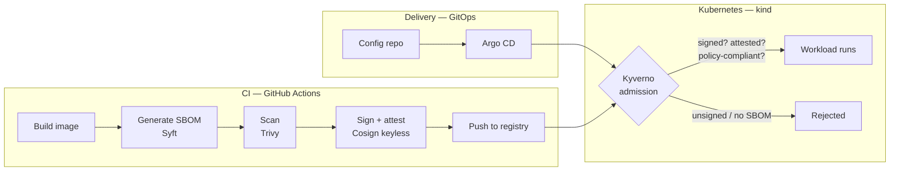

# k8s-secure-supply-chain

**A reference implementation of a secure software supply chain on Kubernetes — built from reusable, self-contained components.**

Every image that reaches this cluster is built, scanned, attested, signed, and admitted by policy. No exceptions, no manual gates.

[](https://github.com/yodim/k8s-secure-supply-chain/actions)
[](LICENSE)

---

## Why this exists

Most supply chain security content is either theory (SLSA levels, NIST papers) or single-tool demos (a Trivy scan in isolation). This repo is the missing middle: a **working, end-to-end platform** you can run locally in ~10 minutes, where each piece is documented as an independent component you can lift into your own stack.

Two ways to use it:

1. **As a reference** — run the whole platform, read the [ADRs](adr/) to understand *why* each decision was made, not just what was chosen.
2. **As a catalog** — take just the [Kyverno signature-verification policy](components/policies/kyverno/require-signed-images/), or just the [reusable secure-build workflow](components/ci/github-actions/secure-build/), and drop it into your own environment. Every component is self-contained with its own README, usage example, and test.

## Architecture



The chain of custody: **source → SBOM → scan → signature → attestation → policy-enforced admission**. An unsigned image, or one without an SBOM attestation, physically cannot run in this cluster.

Scope is deliberately narrow: build-time provenance and admission enforcement, plus lightweight source checks. Runtime threat detection, full SAST platforms and network policy are out, and [ADR-0005](adr/0005-scope-boundary.md) explains each exclusion — this is a supply chain reference, not a complete security program.

## Quickstart

Prerequisites: Docker, [kind](https://kind.sigs.k8s.io/), kubectl, Terraform ≥ 1.7.

```bash
git clone https://github.com/yodim/k8s-secure-supply-chain
cd k8s-secure-supply-chain
make up        # kind cluster + local registry, via Terraform
make bootstrap # installs Argo CD, applies app-of-apps; platform converges via GitOps
make verify    # runs the demo: signed image admitted, unsigned image rejected
```

Tear down with `make down`. Full walkthrough in [docs/quickstart.md](docs/quickstart.md); Windows/WSL2 setup and first-run ordering in [docs/local-testing.md](docs/local-testing.md).

## Component catalog

Each component is independently usable — no dependency on the rest of this repo.

| Component | What it does | Reuse it if… |
|---|---|---|
| [`policies/kyverno/require-signed-images`](components/policies/kyverno/require-signed-images/) | Rejects images without a valid Cosign signature | You want signature enforcement without adopting a full platform |
| [`policies/kyverno/require-sbom-attestation`](components/policies/kyverno/require-sbom-attestation/) | Requires an in-toto SBOM attestation on every image | You need SBOM compliance evidence at admission time |
| [`policies/kyverno/disallow-latest-tag`](components/policies/kyverno/disallow-latest-tag/) | Blocks `:latest` and untagged images | Baseline hygiene, works standalone |
| [`policies/kyverno/require-resource-limits`](components/policies/kyverno/require-resource-limits/) | Enforces CPU/memory limits on all workloads | Baseline hygiene, works standalone |
| [`terraform/modules/kind-cluster`](components/terraform/modules/kind-cluster/) | Reproducible kind cluster with local registry, sized for this stack | You want disposable, CI-compatible clusters as code |
| [`ci/github-actions/secure-build`](components/ci/github-actions/secure-build/) | Reusable workflow: build → SBOM → scan → sign → attest → push | You want the full secure pipeline as one `uses:` line |
| [`ci/github-actions/source-scan`](components/ci/github-actions/source-scan/) | Reusable workflow: secret scanning (gitleaks) + SAST (Semgrep), SARIF to the Security tab | You want source-side checks without standing up a SAST server |

## Decisions (ADRs)

The *why* behind the stack — trade-offs included, not marketing:

- [ADR-0001](adr/0001-kind-over-cloud-for-reference-implementation.md) — kind over a cloud cluster: reproducibility beats realism for a reference platform
- [ADR-0002](adr/0002-kyverno-over-opa-gatekeeper.md) — Kyverno over OPA Gatekeeper for admission policy
- [ADR-0003](adr/0003-cosign-keyless-signing.md) — Cosign keyless (OIDC) over long-lived signing keys
- [ADR-0004](adr/0004-syft-trivy-toolchain.md) — Syft + Trivy: separating SBOM generation from vulnerability scanning
- [ADR-0005](adr/0005-scope-boundary.md) — What this platform deliberately does not do (runtime detection, full SAST platforms, and why)

## Repo layout

```
├── adr/                    # Architecture Decision Records — the why
├── components/             # The catalog — each dir is self-contained & reusable
│   ├── policies/kyverno/   #   admission policies (+ tests per policy)
│   ├── terraform/modules/  #   infrastructure modules
│   └── ci/github-actions/  #   reusable workflows
├── platform/               # The composition — wires components into the reference platform
│   ├── argocd/             #   app-of-apps, bootstrap manifests
│   └── apps/demo-app/      #   sample workload exercising the full chain
├── docs/                   # Quickstart, threat model, architecture notes
└── scripts/                # Bootstrap & verification helpers
```

**Design principle:** `components/` never references `platform/`. Composition depends on the catalog, never the reverse. That's what keeps every component liftable.

## Roadmap

See [ROADMAP.md](ROADMAP.md). Headlines: SLSA provenance attestations, policy exceptions workflow, AKS overlay, Argo CD drift reporting.

## Contributing

Issues and PRs welcome — especially real-world reuse reports ("I took the SBOM policy and hit X"). See [CONTRIBUTING.md](CONTRIBUTING.md).

## License

[Apache-2.0](LICENSE) — deliberately permissive so you can vendor any component into commercial work.

---

*Maintained by [Mehdi Batrone](https://batrone.com) — Systems & DevSecOps engineer.*
